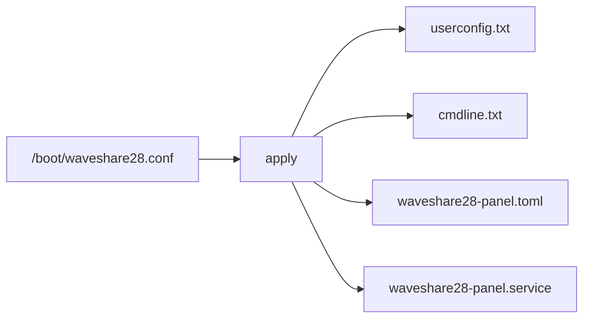
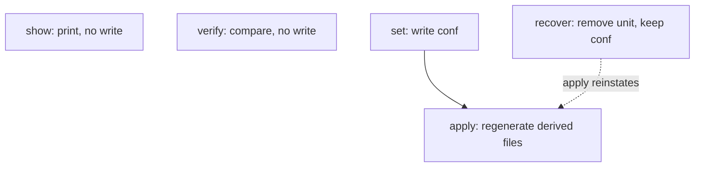
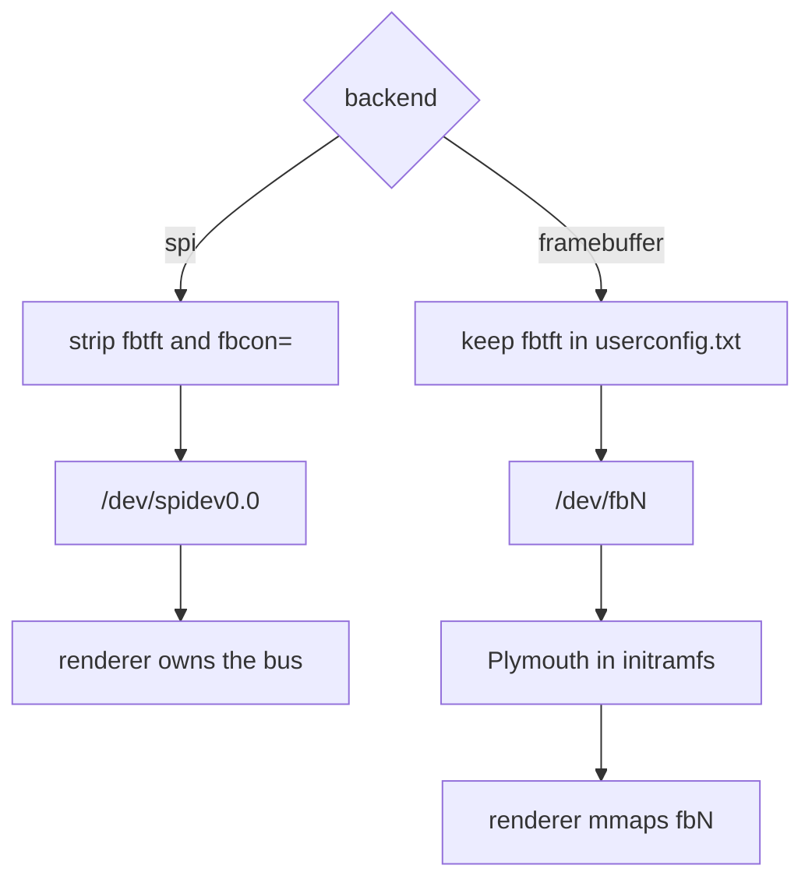
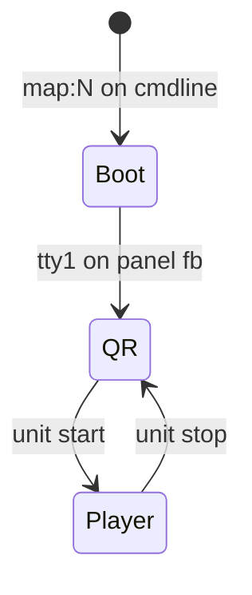
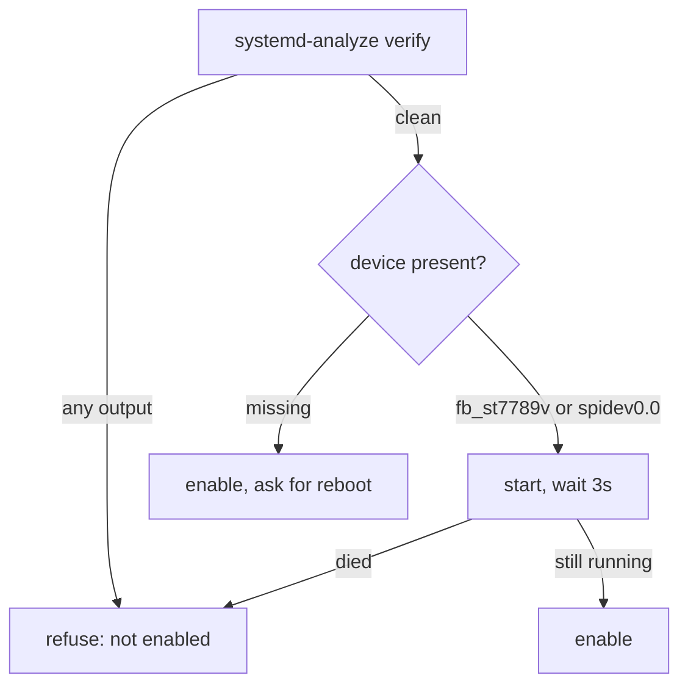

# Configuration

All configuration goes through `waveshare28-config`. Do not edit
`userconfig.txt`, `cmdline.txt`, the unit, or `/etc/waveshare28-panel.toml`
by hand: `apply` regenerates them from the durable file and will overwrite
you.

    waveshare28-config show
    sudo waveshare28-config set rotation=270 backend=framebuffer console=release
    sudo waveshare28-config apply
    waveshare28-config verify
    sudo waveshare28-config recover

`set`, `apply` and `recover` need root. `show` and `verify` do not.

---

## Where the truth lives

`/boot/waveshare28.conf` is the durable copy. `/boot` survives both an OTA
(which extracts a tar over `/boot`, overwriting only what the tar contains)
and a factory reset (which reformats the data partition and leaves `/boot`
alone).

Everything else is derived and rewritten by `apply`:

| File | Role |
|---|---|
| `/boot/waveshare28.conf` | Durable keys. The only file to edit, and only via `set` |
| `/boot/userconfig.txt` | `dtparam=` / `dtoverlay=` for SPI, touch, and optional fbtft |
| `/boot/cmdline.txt` | Two `fbcon=` tokens, and only those, when `backend=framebuffer` |
| `/etc/waveshare28-panel.toml` | What the renderer reads. Overwritten on every `apply` |
| `/etc/systemd/system/waveshare28-panel.service` | The unit, including fbcon bind/unbind |

A factory reset destroys the root overlay, taking the binary, the unit and
the module with it. The installer has to be re-run. The durable file
surviving means that re-run restores the settings rather than asking again.

Never edit `/boot/config.txt` or `/boot/volumioconfig.txt`. They are system
managed and an OTA overwrites them.

---

## Commands

### `show`

Prints the loaded settings. No root. A missing durable file is not an
error: defaults are used and `source` says so.

### `set key=value...`

Writes the durable file, then runs `apply`. Several keys on one line are
applied together, so a backend and a rotation cannot be half-written.

    sudo waveshare28-config set rotation=270
    sudo waveshare28-config set backend=framebuffer console=release

Unknown keys are refused. A typo does not become a silent no-op.

`splash=` is obsolete. If it is still in the file, `apply` warns and
ignores it; use `backend=framebuffer`.

### `apply`

Regenerates every derived file from the durable copy, then enables the
unit. Use this after an OTA that has dropped `fbcon=` from `cmdline.txt`,
or after restoring `/boot/waveshare28.conf` onto a freshly installed image.

It validates before writing anything, so a bad value cannot leave the
system half configured.

### `verify`

Reports drift against the durable file and exits non-zero if anything
differs. Usable from a health check. It does not change anything.

Checks include: SPI and touch overlays, fbtft lines or their absence,
`fbcon=` tokens, the generated toml, the unit (including whether it
unbinds fbcon), that the unit is enabled, that the binary is present, and
that a touch module exists for the running kernel.

A kernel OTA replaces `cmdline.txt`. Not every update does. `verify`
names the missing tokens; `apply` puts them back.

### `recover`

Disables and removes the panel unit (and a leftover splash unit from an
earlier design). Rebinds fbcon if it was released. Does **not** touch
`/boot/waveshare28.conf`.

For the case where the device still boots but the panel service is
misbehaving. `sudo waveshare28-config apply` reinstates.

If the device would not boot, the units live on the data partition under
`/dyn/etc/systemd/` and can be removed with the card in a reader.

---

## Durable keys

Defaults, used when the file is absent or a key is omitted:

    rotation=0
    speed=32000000
    backend=spi
    console=release
    hdmi=off

### `rotation`

Degrees clockwise: `0`, `90`, `180` or `270`.

This is the only place rotation is set for the renderer. The panel is
rotated by the display path and touch is mapped back through the same
value, so the two cannot disagree.

fbtft's `rotate` is counter-clockwise. `apply` converts when it writes
the overlay:

| `rotation` (clockwise) | `dtparam=rotate=` (fbtft) |
|---|---|
| 0 | 0 |
| 90 | 270 |
| 180 | 180 |
| 270 | 90 |

The working orientation on the 2.8 inch module, landscape with the ribbon
as people usually mount it, is `rotation=270` / `dtparam=rotate=90`.

On `backend=framebuffer` the framebuffer size must match that layout or
the renderer refuses to open. Changing rotation after a framebuffer boot
needs a reboot: fbtft has already sized the panel node.

### `speed`

SPI clock in hertz. Also the fbtft `speed=` when `backend=framebuffer`.
Must be a positive integer.

The bcm2835 divides `core_freq` by an even integer, so the achieved rate
is the nearest divisor step, not this exact value. `32000000` is the
reference.

### `backend`

`spi` or `framebuffer`. They cannot be mixed: one SPI chip select, one
owner.

**`spi`** — the renderer owns `/dev/spidev0.0` and the DC, reset and
backlight GPIOs. `apply` removes the fbtft overlay lines and the `fbcon=`
tokens. The panel framebuffer will not exist. No Plymouth on this panel.

**`framebuffer`** — fbtft stays in `userconfig.txt` (firmware-applied, not
removable at runtime) so the panel framebuffer exists in the initramfs
and Plymouth can bind it. After `plymouth-quit` the renderer mmaps that
node and claims none of those GPIOs. `/dev/spidev0.0` is gone for the
life of the boot.

The node is the `fb_st7789v` device, not a hardcoded `/dev/fb1`. HDMI
or the firmware `bcm2708_fb`/KMS framebuffer can occupy `fb0` (640×480
on this Pi 5 cmdline) and leave the panel on another index, or the
panel can be `fb0` itself. `apply` writes the live name only. It does
not guess a free slot: that can select the KMS node. If the overlay is
not on this boot yet, `fb_dev` is omitted and `fbcon=map` is deferred
until the next `apply` after reboot.

A firmware overlay written or removed in `userconfig.txt` is not visible
until the next reboot. `apply` will say so, enable the unit, and not
start it on a device that is not there yet.

### `console`

`share` or `release`. Framebuffer only. Ignored on `backend=spi`, with a
warning if the key is actually in the file.

`fbcon=map:N` stays on the cmdline either way, so TTY1 and the `/etc/issue`
QR are on this panel at boot and when the service is down.

With `console=release` the start transition unbinds fbcon and the stop
transition rebinds it. With `console=share` fbcon stays bound in
`Player`.

**`release`** (default) — the unit unbinds the framebuffer vtconsole for
the life of the process and rebinds on stop. A USB ethernet disconnect
cannot dump kernel text onto the player. The QR comes back when the unit
stops.

**`share`** — fbcon stays bound. Kernel messages and a getty redraw of
the QR overwrite the player. The renderer is still running; the next
scene change (or a cover tap) paints it back.

The panel runs as `volumio` and cannot write sysfs. The unit uses
`ExecStartPre=` / `ExecStopPost=` with `+` so those two writes run as
root. Switching away from `release` rebinds in `apply` itself, because
the new unit no longer has an `ExecStopPost` to do it.

### `hdmi`

`off` or `on`. Pi 4 family (`bcm2711`: Pi 4, Pi 400, CM4) and
`backend=framebuffer` only. Ignored on other boards and on
`backend=spi`, with a warning if the key is actually in the file.

`apply` reads `/proc/device-tree/compatible` to decide. Default is
`off`: on a Pi 4 it writes the `[pi4]` / `[all]` stanza that cancels
Volumio's `hdmi_force_hotplug=1`, so Plymouth can bind the panel.

    sudo waveshare28-config set hdmi=on

keeps HDMI for audio or a real monitor. Plymouth then stays on HDMI.
The `[pi4]` filter is still the firmware gate, so a userconfig copied
onto a Pi 5 cannot turn that board's HDMI off.

---

## What `apply` writes

Keep every `userconfig.txt` line under 100 characters. The firmware
silently truncates longer lines, dropping the tail of the last parameter,
with no warning anywhere. That is why the fbtft parameters are split
rather than written as one `dtoverlay=` line.

Always:

    dtparam=spi=on
    dtoverlay=cst328

I2C is already enabled on Volumio (`dtparam=i2c_arm=on` in
`volumioconfig.txt`). SPI is not.

`backend=framebuffer` also writes:

    [pi4]
    hdmi_force_hotplug=0
    [all]
    dtoverlay=fbtft,spi0-0,st7789v
    dtparam=width=240,height=320
    dtparam=reset_pin=27,dc_pin=25
    dtparam=led_pin=18,speed=<speed>
    dtparam=rotate=<counter-clockwise>

The HDMI stanza is written only when this board is Pi 4 family,
`backend=framebuffer`, and `hdmi=off`. `[all]` must follow so the fbtft
lines are not trapped inside `[pi4]`. `hdmi=on`, `backend=spi`, or any
other board removes the stanza.

`apply` never edits `volumioconfig.txt`. On a Pi 3A+ it reads this
board's revision from `/proc/cpuinfo` and inspects `volumioconfig.txt`
for that scope only (`[0x9020e0]`, `[0x9020e1]`, or a later 3A+
revision). Volumio 4.119 ships `[pi3] dtoverlay=vc4-kms-v3d` only; that
full-KMS line does not boot 512 MB 3A+ boards. The durable fix is an
image update. Until this board's scope is there, `apply` writes it
into a marked `userconfig.txt` block:

    # waveshare28-3a-kms-begin
    [0x9020e1]
    dtoverlay=vc4-kms-v3d,cma-128
    [all]
    # waveshare28-3a-kms-end

Pi 4, Pi 5, and other Pi 3 boards are left alone; a leftover block
from a card moved off a 3A+ is removed. A scope already present in
`volumioconfig.txt`, or already present elsewhere in `userconfig.txt`,
is not copied. After an OTA that adds the filter, the next `apply`
removes the marked block. This cannot unbrick a 3A+ that never reaches
userspace; first boot still needs the image fix or a one-time
`userconfig.txt` edit with the card in a reader.

and two tokens on `cmdline.txt` once the panel node is visible:

    fbcon=map:<N> fbcon=font:VGA8x16

`apply` touches only `fbcon=` words on that line. Everything else is
Volumio's. An empty write is refused outright.

`fbcon=map:N` puts TTY1 on the live `fb_st7789v` node. With
`hdmi_force_hotplug=0` that is usually `map:0`. If HDMI is still forced
on, the panel is typically `fb1` / `map:1`. `apply` does not guess `N` from a free slot:
the firmware can create a 640×480 KMS framebuffer that is not this
panel. If the overlay is not on this boot yet, only the font token is
written; run `apply` again after reboot to pin `map:N`.

`fbcon=font:VGA8x16` forces 8x16 cells so the QR in `/etc/issue` has
square modules. fbcon picks 8x8 at 320x240 otherwise, and half-block
characters in an 8x8 cell make each module twice as wide as it is tall.
The font is built into the kernel; `kbd` is not in the Volumio
repositories. Both tokens belong together once `N` is known.

`backend=spi` removes the fbtft lines and both `fbcon=` tokens.
A leftover `map:N` would otherwise point at the wrong framebuffer.

The generated toml is only what the renderer needs from these keys:

    backend = "framebuffer"
    fb_dev = "/dev/fb0"
    rotation = 270
    spi_speed_hz = 32000000

`fb_dev` is written only when `fb_st7789v` is already registered, so
`apply` cannot replace a working panel path with `/dev/fb1`. The
renderer also finds that node by name if the hint is missing or points
at KMS.

Edits there are overwritten. Pin map, URLs and poll intervals have
defaults in the binary that match SKU 27579. They are not keys of
`waveshare28-config`.

---

## Unit enablement

The unit is a leaf. Nothing depends on it. It is `After=local-fs.target
plymouth-quit.service` and is not ordered after `volumio.service`: the
renderer shows addresses until the backend is ready, and waiting would
leave the panel dark for the whole boot.

`apply` writes the unit, runs `systemd-analyze verify` and refuses on any
output, then:

- if the backend device exists (`fb_st7789v` or `/dev/spidev0.0`): start,
  wait, confirm it stayed up, then enable
- if it does not: stop any current instance, enable, ask for a reboot

A unit that cannot start in the current boot never becomes persistent.
Two earlier ordering mistakes wedged a device badly enough to need
reflashing; see `DEFECTS.md`.

---

## Typical setups

Plymouth and the player on this panel (the usual path):

    sudo waveshare28-config set rotation=270 backend=framebuffer console=release

Pi 4, keep HDMI (audio or a monitor). Plymouth stays on HDMI:

    sudo waveshare28-config set hdmi=on

Renderer owns the bus, no splash on this panel:

    sudo waveshare28-config set rotation=270 backend=spi

After a kernel OTA that has dropped `fbcon=`:

    waveshare28-config verify
    sudo waveshare28-config apply

After a factory reset, re-run the installer. It calls `apply`, which
reads the surviving `/boot/waveshare28.conf`.

---

## What this file is not

Boot sequencing, readiness, and what the panel *shows* are in
[BOOT-FLOW.md](BOOT-FLOW.md). Hardware wiring is in the root `README.md`.
Open defects are in `DEFECTS.md`.
